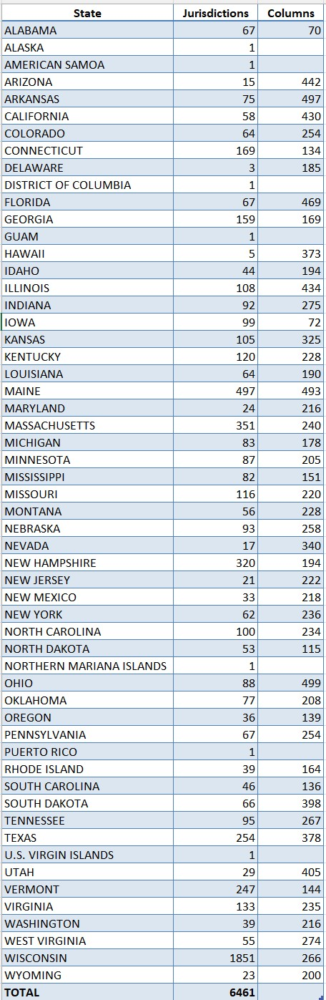
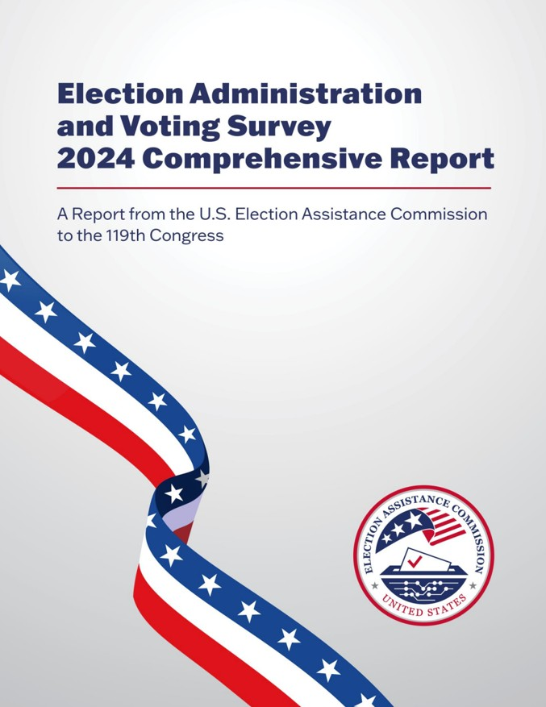

# Data from EAC's Election Administration and Voting Survey (EAVS) Comprehensive Report

# 2024

See [EAC Studies and Reports](https://www.eac.gov/research-and-data/studies-and-reports) page.

Data accompanying the 2024 EAVS report was released online on June 30, 2025.

Data files in five formats were available.  This project started with the [CSV file](https://www.eac.gov/sites/default/files/2025-06/2024_EAVS_for_Public_Release_nolabel_V1_csv.zip), which can be downloaded as 2024_EAVS_for_Public_Release_nolabel_V1_csv.zip`.

When browsed in Excel this file contained a staggering 535 columns of data for each of 6461 "jurisdictions" (counties in most states).

Most states (or DC or territories) had many columns of data missing, or coded with special numbers (-77, -88, and -99) that were constant for a whole column.

A Posit R Notebook manipulates this large table and extracts data for all the jurisdictions in a state, and removes columns that were missing data or were constant.

A state-specific modified "Codebook" (based on the [EAC Codebook](https://www.eac.gov/sites/default/files/2025-06/2024_EAVS_Codebook.xlsx)) indicates why columns were removed.

EAC for some reason used quite cryptic columns names in the data, but provided a verbose version in its Codebook.

All the extracted state files use the more verbose human-readable labels, but a state Codebook shows both cryptic and verbose names, and some minimal descriptive information.

The `States` folder usually has three files.

For example for Kansas:

* 2024-EAVS-KANSAS-Raw-Data-with-Labels.xlsx [105 counties by 535 columns]

* 2024-EAVS-KANSAS-Abridged-Data.xlsx [105 counties by 325 columns]

* 2024-EAVS-KANSAS-Codebook.xlsx [535 rows of information about all original EAVSfields]

A state with only a single jurisdiction only has a single file with the single line of EAVS data.

The table below shows the number of jurisdictions (usually counties) by state.

